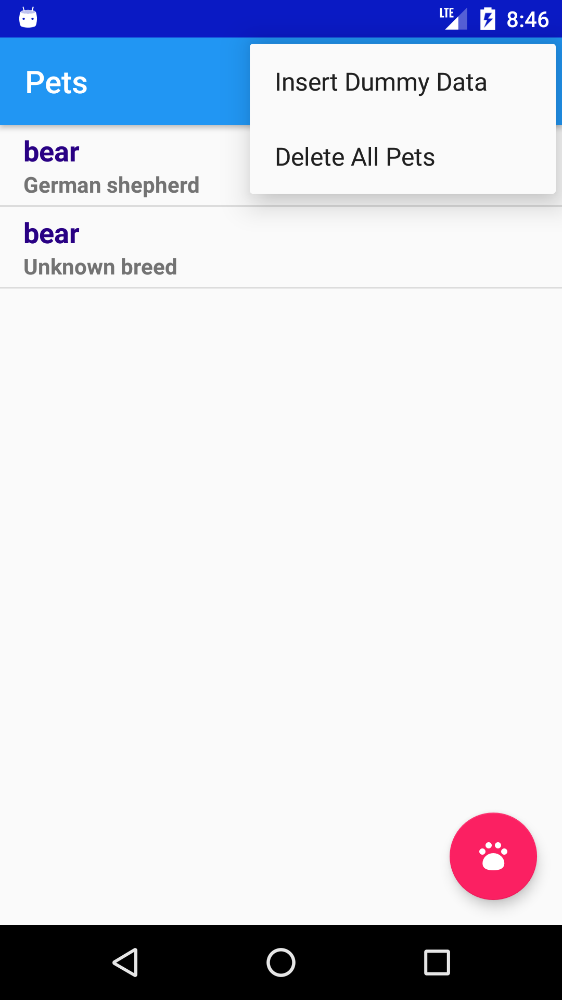
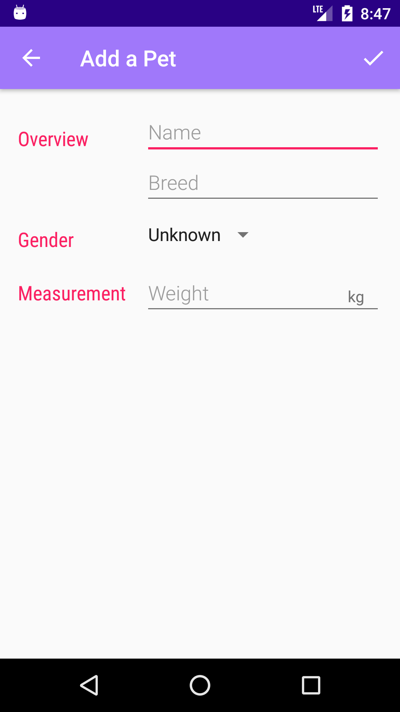
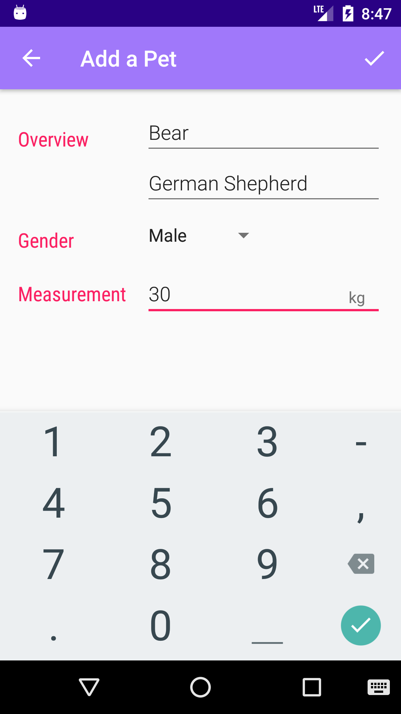
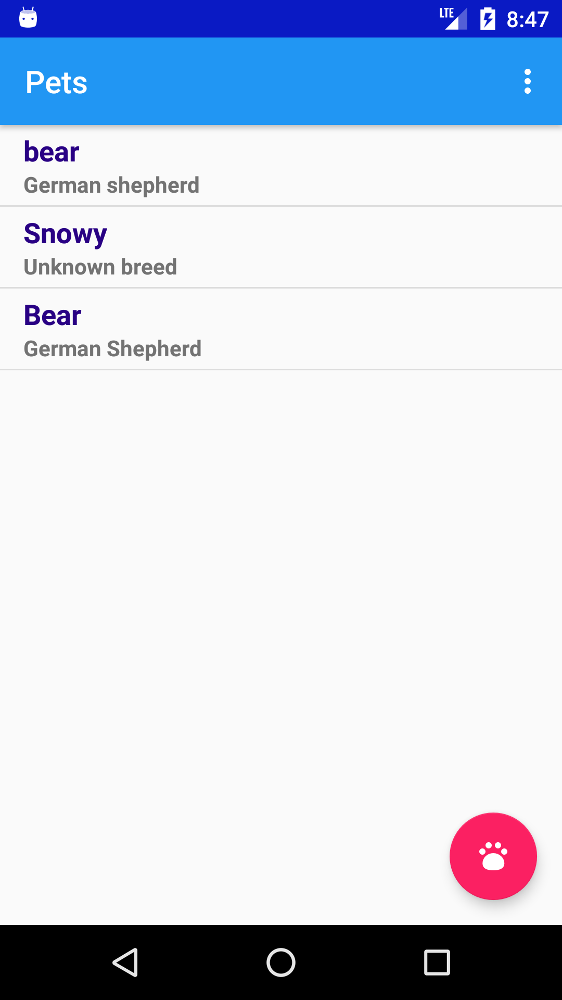
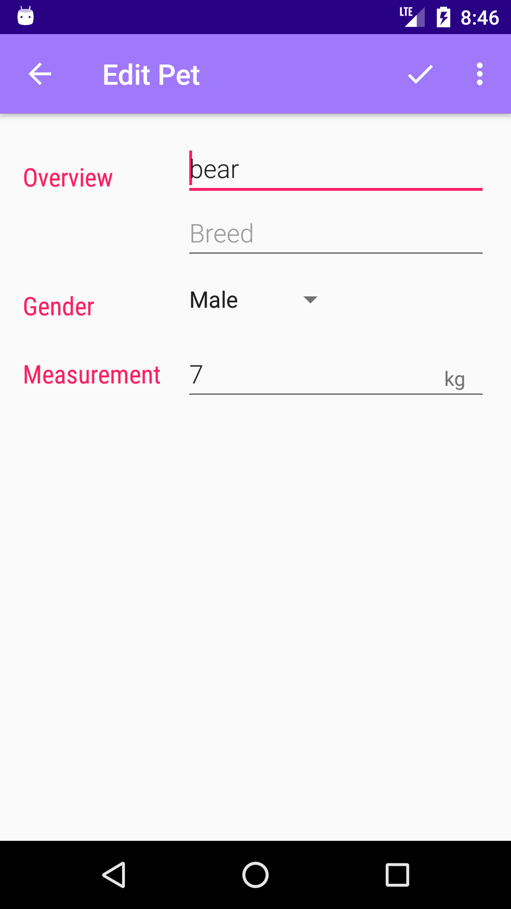
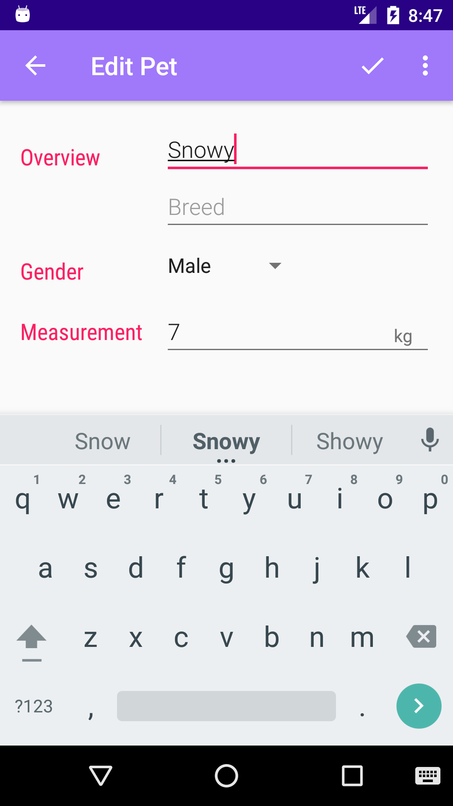
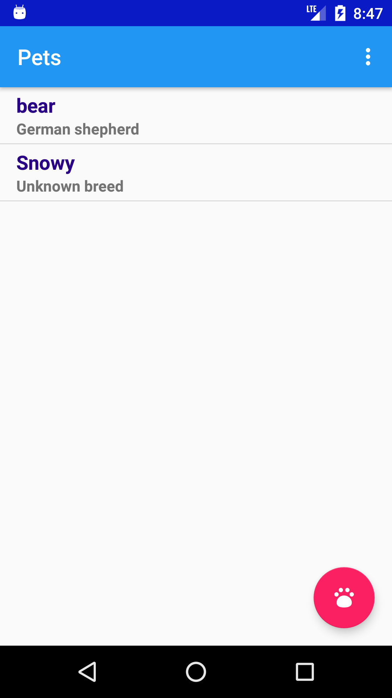

# MyPetsApp
This application is made while taking **udacity ud845** - **Data Storage** in Android Course.

**Feature used :**
  - Sqlite Database
  - Cursor
  - Content Provider
  - Content Resolver
  - Content Uri
  - Dynamic used Single activity in multiple ways with different functionality

---

|               |              |
| :-----------: | :----------: |
|  |  |

---
**MyPetsApp**  lets you Record and maintain the pets Details. Its using SQLite Data base to storing pets details.

This app as two Activity :
  - Catalog Activity
    - **Catalog Activity** uses a **ListView** to Show the Summary of added Pet

  - Editor Activity
    - **Editor Activity** is being used in **Two Mode** 
      - For Adding a Pet
      - For Editing a Pet

  #### Mode 1- for Adding New pet -snapshots
| Step 1- Add a pet | Step 2- Fill Details | Step 3- Save the Pet |
| :---------------: | :------------------: | :------------------: |
|      |          |          |

  #### Mode 2- for Editing a pet -snapshots

| Step 1- Edit a pet | Step 2- Make change | Step 3- Save the Pet |
| :----------------: | :-----------------: | :------------------: |
|       |         |          |

